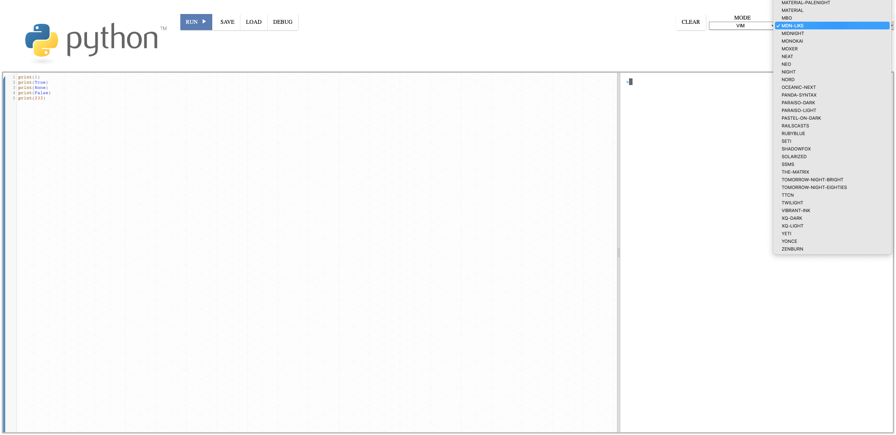
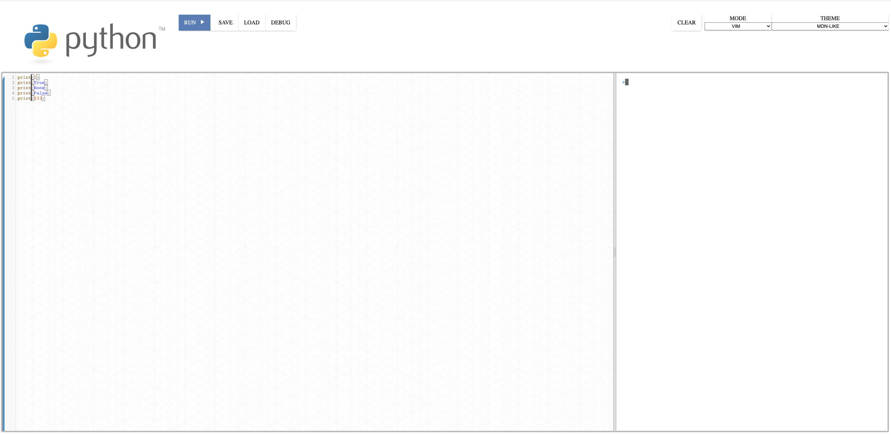

# Frontend Design

## Week 10 Update

### Done

In this week, we completed most our design.

- Bugs: In the previous version, there were some bugs: print(False) will generate redundant "pre" elements on the interactive area, printing fields of type boolean in object cannot displays fields'name, printing fields of type None will cause stack overflow and the 'env' module in wasm cannot be updated, etc. We have fixed all these known bugs.
- Layout: We updated the layout of the page and carefully adjusted the fonts, colors and sizes, etc. of the interactive area. We also hided unwanted elements and made error messages more visible.
- Drag bar: It could make adjustment of the size of the editor field and interactive console. With this feature users can focus on a specific mode they are instereted in.
- Clear button: Clicking this button would reset all content in the editor and interactive area.
- Refresh button: Clicking this button would remove error hits and breakpoints in the editor.
- End-to-end test: Referring to the 2021 repo, we introduced Cypress as the testing automation solution used for web automation. Testcases are defined in cypress/integration/fronted.spec.js. Uses could simply run `npm run e2e` to start this test tool.

With the power of codemirror, we introduce other fancy features in the editor field:

- Themes selection: A simple select menu to change the editor style with many options.
- Edit mode: Users could switch between normal mode and vim mode of editor and write code like in vim.
- Breakpoint: With breakpoints, users could control the scope of the code running. We are currently unable to add watchers as the stack is inaccessible.
- Error highlight: The code location returned by the error reporting module will be displayed in the editor.
- Autocompletion: When the user presses the ctrl key, code before the cursor can be automatically completed based on the rules of the config file.

The overall front page looks like below:


### Future work

The dictionary and string implementations have not been merged into the repository before June 1st, thus we can't handle the rendering feature for either.

For list, we tried to track list's elements on the heap and implement the nested printing of list and object. However, on the one hand, we found that list organizes the heap differently between the merged git repo and the unmerged git repo as the list team keep updating its implemention. On the other hand, the list team is also implementing its own list print function. Before merging, we cannot integrate list with our code.

For set, the set team has fully integrated its implementation into the wasm code, and also implemented its own set print function, which makes it more difficult for us to integrate set into front-end rendering.

After all conflicts of this merge have been solved, we could continue to deepen the implementation of list and set. One potential solution is to use their own print function and wrap them to achieve nested rendering.

## Week 8 Design

### 1. Add clear button

Once users press the button, all the content in repl object will be removed and the console and code area will be cleaned.

### 2. print the global variable

We think the debug model is important for users getting to know what is going on in the program, so we find a way to print out all the global varaibles.

### 3. Change a way to represent the object

In order to represent all the global varialbles, we might need to write a new function to show the object.

### 4. Drag bar between the code field and Console

To add more flexibility, we add the drag bar to make adjustment of the size of the code field and console. So the users can focus on a specific mode they are instereted in.

### 5. Beautify the console

The console right now is consist of textareas and the textarea will be mess if they have different size. So we want to implement a console without textarea and will show the active line.

### 6. Themes

To make our compiler more accepetable by users, we want to provide more themes so that the users can choose from.

We provide multiple themes for users to choose. Users can also pick a random theme by clicking the theme button.


### 7. Support other object like list, string

We will implement the render to hanle other objects like list, string and dictionary. This design will be achieved in outputrender.ts in the same way as the class objects. Besides, the layout for displaying the list or dictionray in REPL area should be carefully design to make sure it is clean and obvious.

### 8. highlight the error area

shown in the picture below, CodeMirror is able to underline the error


### 9. front end test

Our team have comunicated with team A and find that there is a tool called [phantomjs](https://learnku.com/docs/node-lessons/browser-side-test-mocha-chai-phantomjs/6131) for front end testing.

### 10. Edit mode

To provide an option for the editor preferences of users, we add vim edit mode for users to choose, user can choose to change to vim mode and use default vim keymap to edit their code. And user can switch between normal mode and vim mode by clicking the mode button.



The overall front page will looks like below:


## Week 7 Update

### Done

This week, we took a deep dive into the existing implementation and learned the front-end interface from scratch. On the one hand, we fixed the obejct display bug in the original code, and on the other hand, we completed most of the tasks committed last week.

- Fixed existing front-end bugs, refactored some render codes, and created an outputrender.ts to display the results of repl.
- Tested to make sure the frontend can display all kinds of error and correct results properly.
- Significantly refined the layout, making the buttons more intuitive and the interaction mode more beautiful.
- Implemented code highlighting and line number display through the CodeMirror library. Also implemented simple auto complete function with ctrl pressing.
- Introduced new design, save and load functions that allow users to run and save scripts locally.
- Implemented heap tracking and printing all current object and its fields, showing with the accordion effect.

You could try this script to see our implement.

```Python
class C(object):
    x:int = 0

c:C = None
c = C()
c
```

### Plan

- Print current heap status. In our code, the heap value can already be read as console.log, however, it is necessary to discuss with the memory management team to further determine the best solution for displaying the heap.
- Introduce Cypress to automate front-end testing.

## Week 6 Front End Design

### 1. Change the Code input box of compiler side

The input box is slightly out of screen and the result will show on the side of interaction mode.
What we try to implement here is to move result to the bottom of compiler mode and make sure they can shown on the same page. The size of box will keep unchanged and we can scoll inside the box.

### 2. The input box of interaction mode remains center

Right now, the box of interaction will add to the bottom of all the input boxes and dispear if user doesn't scoll down. We can keep the the last one box still seen to users when users doesn't operate.

### 3. Make adjustment of proportion of two mode on Web page

The compiler sides will need more space. We will also try to adjust the layout and elements to make it more beautiful. Refer to the design method of VS Code and Jupyter Notebook.

### 4. The size of input box of interation mode remains the same

The input boxes of interaction mode can change to different size. We want to keep them in same size.

### 5. Show the number of code line on the compiler side

It is important to display line numbers on the right side of the code editing area. This helps us understand the code and locate errors. We will add line numbers to the edit area on the comiler side. This could be an element that changes dynamically with the input text.

### 6. Show all kinds of error and correct results properly

Try to run different source code on the page to make sure the website displays the correct results.  
In the same way, use the features' testcases written by each group, try to input different error source codes, trigger the parse error, type error and runtime error, to make sure that our front-end page displays the results correctly and beautifully.

### 7. print all the fields in an object properly

In interaction mode, whenever we instantiate a class, we want to be able to let the user to monitor the current objects and the fields in that objects like the IDE's debugger. This can be achieved by analyzing the current AST and searching the heap.

### 8. Display the space that heap have used

It may need information from the memorry management team.

We can access the memory in the module through `WebAssembly.Memory`, where `Memory.prototype.buffer` is an `ArrayBuffer` with the contents of linear memory. Also, the WebAssembly call stack is not stored in memory, and is not accessible, so the stack of called functions and their locals can not be displayed.

### 9. Show the global variable of wasm

The global variable seems can be get from

```javascript
Object.keys(instance.instance.exports).forEach(k => {
      console.log("Consider key ", k);
      const maybeGlobal = instance.instance.exports[k];
      if(maybeGlobal instanceof WebAssembly.Global) {
        currentGlobals[k] = maybeGlobal;
      }
    });
```

### 10. highlight the code

This can be done step by step:

- Modify Application Code `webstart.ts`

- Add packages in `package.json`

- Modify `webpack.congfig.js`

We probably will refer to [CodeMirror](https://codemirror.net/) as our code editer JS library.
